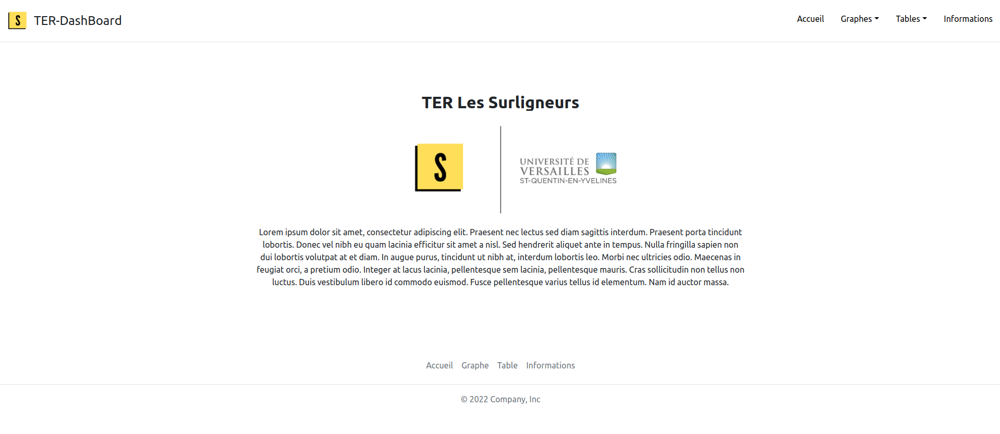
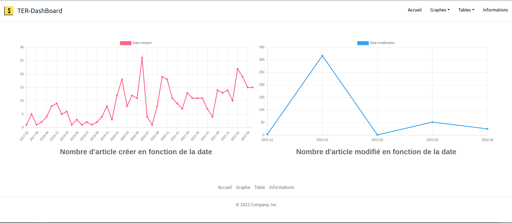
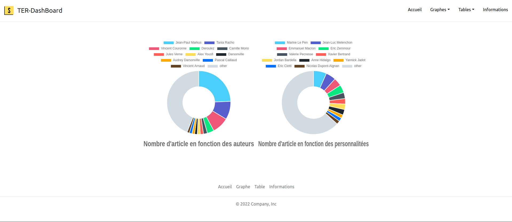
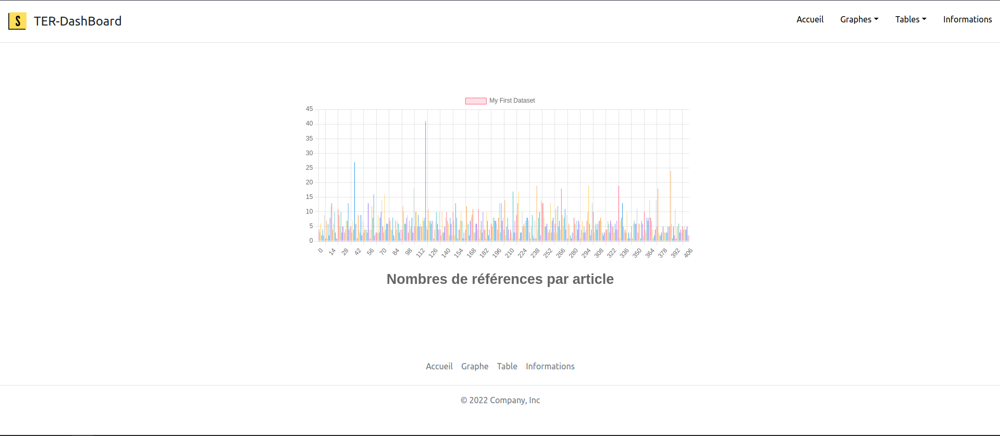
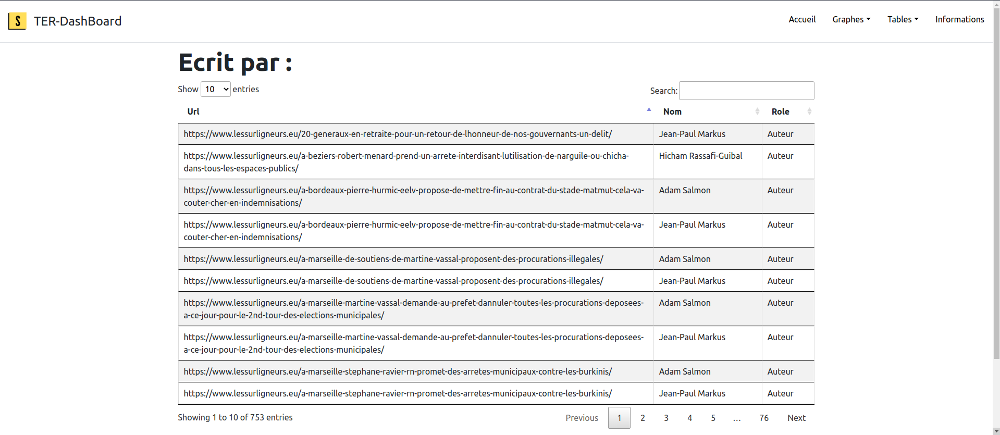
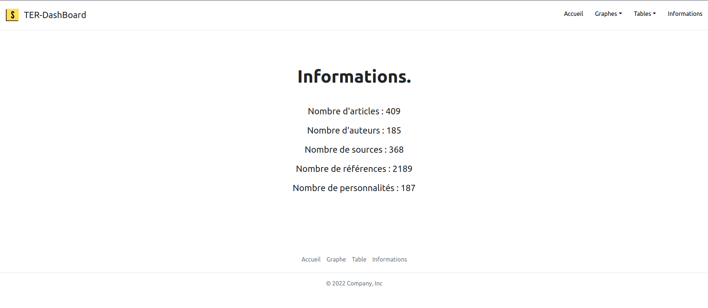

# Guide d'utilisation du DashBoard

Notre site web ce découpe en 4 parties :
 - Accueil
 - Graphes
 - Tables
 - Informations

---

## Accueil:
Image de l'accueil de l'application :  

--- 

## Graphes:
Image du graphe représentant le nombre d'articles crées et modifiés par mois :  

  

Image du graphe représentant le nombre d'articles écrit par un auteur et le nombre d'article parlant d'une personnalité :

 
Chaque élément de la légende peut être masqué en cliquant dessus afin de le faire disparaître du graphe.

Image du graphe représentant le nombre de référence ce trouvant dans un article, pour chaque article.

  

---

## Tables:
Dans la catégorie `Tables`, nous affichons les différentes tables qui constituent notre base de donnée. 
Il est possible de régler le nombre de tuples affiché dans la table sur une même page,
ainsi que de faire des recherches dans la table via la barre `Search`. 

Exemple avec la table `Ecrit par`:

---

## Informations:
La page `Information` permet d'afficher des informations simple sur 
certain élément de la base de donnée comme par exemple le nombre d'articles, le nombre d'auteurs... 

